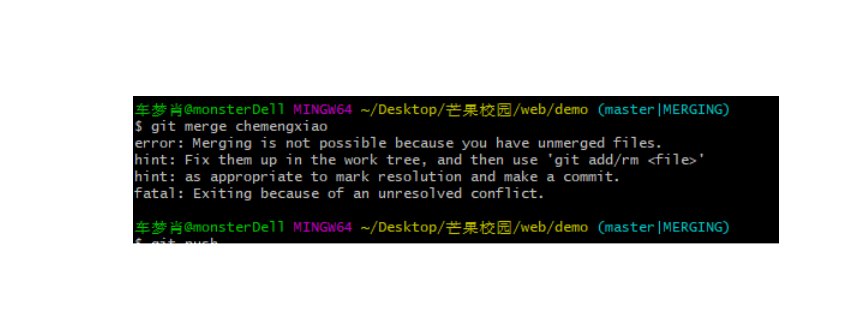
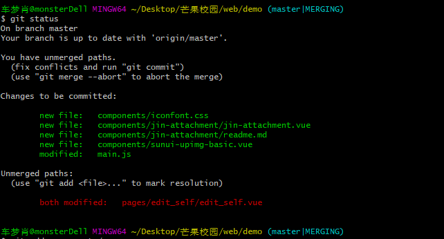
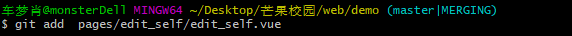
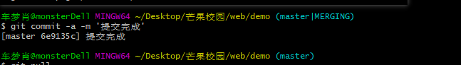
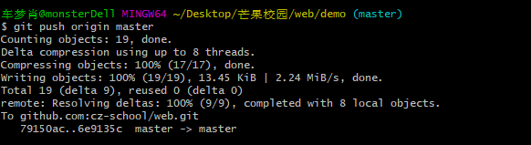

# api
根据提供的服务器账号密码登录服务器。
进入项目文件路径：cd /cz-school/api
使用git拉取代码：git pull
## 项目会自动重启，请勿担心如果出错请及时联系管理员！！！

# 提交代码
如何将本地代码提交到远程分支（master）上？
  # 步骤一: 准备工作
1- 打开 git push here 窗口
2- 创建一个本地分支 git  checkout -b test   (test 就是你的本地分支，这里是假设)
3- 每天写的代码注意要写在自己创建的分支上面
  # 步骤二： 提交代码
1- 将本地的修改提交到本地缓存区
2- git add . (提交所有修改 或者可以 git add 文件路径 + 文件名 进行提交)
3- git commit -m 'add:修改时间+提交内容' (注意：这个时候你已经将所有你修改的代码提交到你自己创建的分支的缓存区了,不需要git push,写了可能会报错) 
  # 步骤三 分支合并提交
1- 切换到master 分支 git checkout master (如果不行，就强制切换 git checkout -f)
2-  git push origin master 或者git push  注意：这里一定要保证本地master分支的代码必须是最新的，不然提交会失败出现各种问题
3- 合并自己的本地分支 如test分支 git merge test  此时已经将所有修改和本地master合并
4- 将本地代码提交到远程分支master上面 git push origin master 
  # 建议
  提交完代码时候 将自己创建的本地分支删除掉 ，重新创建一个分支，因为此时的test分支和master分支版本不同 ，
  如果不删除，需要将master 分支上的代码合并 并 更新到test 分支上面 建议先删除后创建 
  git branch  -d test  删除test分支
  gut checkout -b test 创建一个test分支  
  这样就保证版本相同了。  

 

#git 冲突问题 

原因：两个人同时修改了一个代码，两人代码冲突了，提交之后，他代码git自动合并，git 提示 并提示: *[master| MERGEING]*  如：

这个时候不要慌   

步骤一 在git命令行中输入 git status 或者git  diff

看到那个图片红色的区域了吗  那个both modified 意思就是代表 共同修改的文件

然后通过 复制那个both modified 后面的路径

通过 git add  填写你刚才复制的那个路径，就好了

最后通过git commit -a   -m '修改冲突完成'    效果如图

最后再 git push origin master 就好了  如效果图

